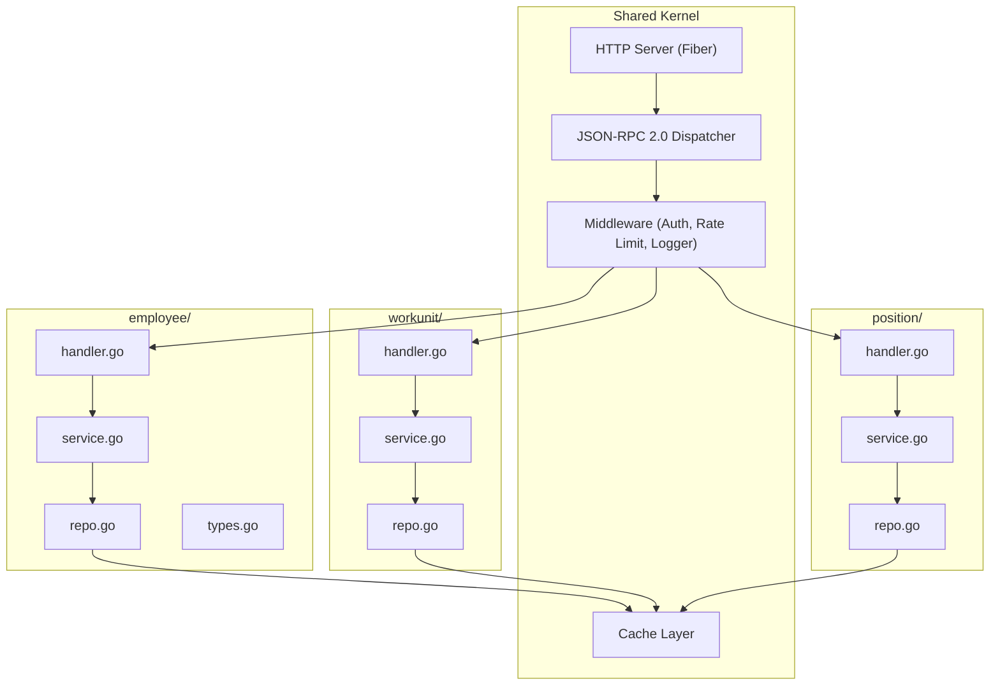
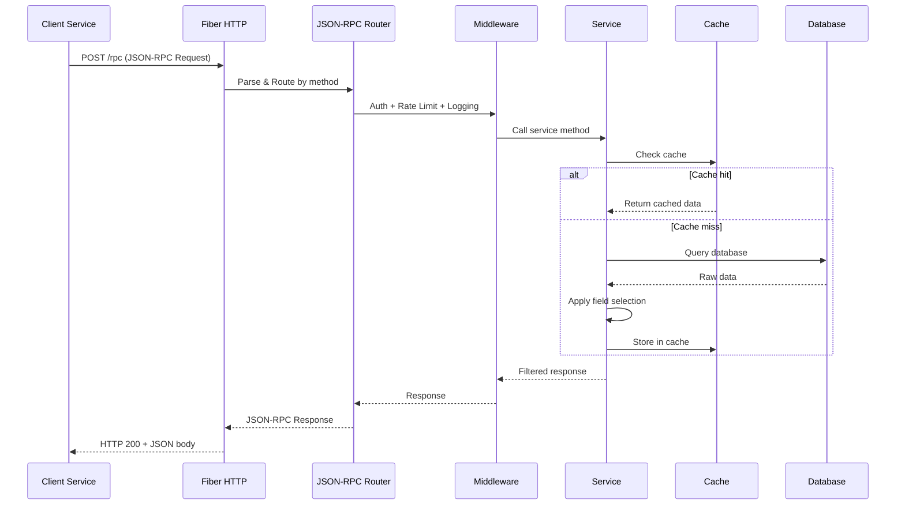
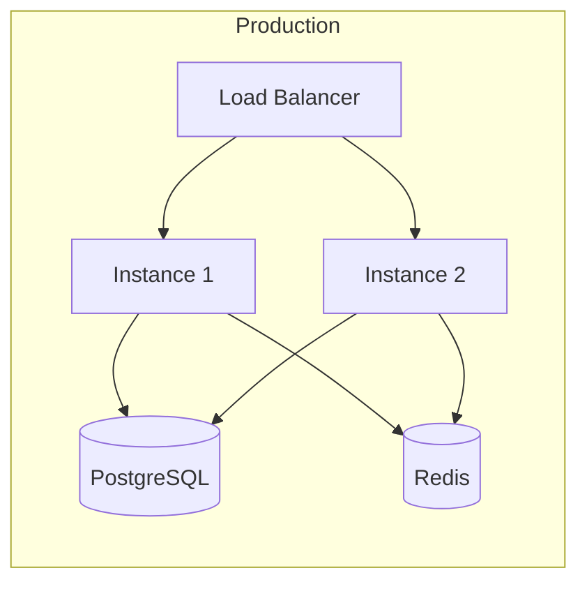

# System Architecture — UNU Master Data API

## 1. Overview

UNU Master Data API is the **single source of truth** for all employee data across Universitas Nahdlatul Ulama. This API replaces the redundant data access pattern where each service fetches the entire employee dataset despite only needing a subset of fields.

### Problem Solved

```
┌──────────┐     ┌──────────────┐
│  SIOBA   │────▶│              │  ❌ Each service queries DB directly
│  Presensi│────▶│   Employee   │  ❌ Response contains unnecessary data
│  Cuti    │────▶│   Database   │  ❌ No standardized data format
│  Agenda  │────▶│              │  ❌ Duplicated transformation logic
└──────────┘     └──────────────┘
```

### Solution: Centralized Master API

```
┌──────────┐     ┌───────────────────┐     ┌──────────────┐
│  SIOBA   │────▶│                   │     │              │
│  Presensi│────▶│  Master Data API  │────▶│   Employee   │
│  Cuti    │────▶│  (JSON-RPC 2.0)   │     │   Database   │
│  Agenda  │────▶│                   │     │              │
└──────────┘     └───────────────────┘     └──────────────┘
                   ✅ Single entry point
                   ✅ Field selection per service
                   ✅ Standardized response format
                   ✅ Centralized caching & logging
```

---

## 2. Application Architecture

### Domain-Driven Design — Flat DDD

Each business domain is organized as a flat package without sub-folders:



### File Description (per Domain)

| File | Responsibility |
|:-----|:---------------|
| `handler.go` | JSON-RPC method handler, parse params, call service, return response |
| `service.go` | Business logic, use cases, field selection |
| `repo.go` | Database access (PostgreSQL), repository interface + implementation |
| `types.go` | Entity, DTOs, value objects, enums |
| `errors.go` | Domain-specific errors |
| `service_test.go` | Unit tests |
| `mocks/` | Generated mock files |

### Shared Kernel

| Package | Responsibility |
|:--------|:---------------|
| `internal/shared/config/` | Configuration loader |
| `internal/shared/middleware/` | Fiber middleware (auth, rate limit, logger) |
| `internal/shared/jsonrpc/` | JSON-RPC 2.0 request/response, dispatcher, errors |
| `internal/shared/cache/` | Cache abstraction |
| `internal/app/` | Fiber app bootstrap, DI wiring, route registration |

---

## 3. Protocol: JSON-RPC 2.0

### JSON-RPC vs REST

| Aspect | REST | JSON-RPC 2.0 | Choice |
|:-------|:-----|:-------------|:-------|
| Endpoint | Multiple URL paths | Single endpoint `/rpc` | ✅ JSON-RPC |
| Batch request | Non-standard | Built-in | ✅ JSON-RPC |
| Method naming | HTTP verbs + URL | Explicit method name | ✅ JSON-RPC |
| Field selection | Query params (ad-hoc) | Params object (standard) | ✅ JSON-RPC |
| Documentation | OpenAPI/Swagger | Self-describing methods | ✅ JSON-RPC |

> JSON-RPC 2.0 requires `POST` because method name and parameters are sent as a JSON body — `GET` does not support request bodies per HTTP spec.

### Request Format

```json
{
  "jsonrpc": "2.0",
  "method": "employee.getPrimary",
  "params": {
    "nrp": "123456",
    "fields": ["nama_lengkap", "email", "unit_kerja", "jabatan_struktural"]
  },
  "id": 1
}
```

### Response Format

```json
{
  "jsonrpc": "2.0",
  "result": {
    "nrp": "123456",
    "nama_lengkap": "Dr. Ahmad Fauzi, M.Kom.",
    "email": "ahmad.fauzi@unu.ac.id",
    "unit_kerja": {
      "id": "uk-001",
      "name": "Fakultas Sains dan Teknologi",
      "code": "FST"
    },
    "jabatan_struktural": "Dekan"
  },
  "id": 1
}
```

---

## 4. Project Folder Structure

```
master-api/
├── cmd/
│   └── server/
│       └── main.go                      # Entry point
├── internal/
│   ├── app/
│   │   ├── app.go                       # Fiber app setup, DI wiring
│   │   └── routes.go                    # Register all domain handlers
│   ├── shared/                          # Shared Kernel
│   │   ├── config/
│   │   │   └── config.go                # Configuration loader
│   │   ├── middleware/
│   │   │   ├── auth.go                  # API Key authentication
│   │   │   ├── ratelimit.go             # Per-service rate limiting
│   │   │   └── logger.go               # Request/response logging
│   │   ├── jsonrpc/
│   │   │   ├── request.go               # JSON-RPC 2.0 request types
│   │   │   ├── response.go              # JSON-RPC 2.0 response types
│   │   │   ├── dispatcher.go            # Method router & dispatcher
│   │   │   └── errors.go               # Standard error codes
│   │   └── cache/
│   │       └── cache.go                 # Cache abstraction
│   ├── employee/                        # Domain: Employee
│   │   ├── mocks/                       # Generated mocks
│   │   ├── handler.go                   # JSON-RPC method handlers
│   │   ├── service.go                   # Business logic + field selection
│   │   ├── repo.go                      # PostgreSQL repository
│   │   ├── types.go                     # Entity, DTOs, value objects
│   │   ├── errors.go                    # Domain-specific errors
│   │   └── service_test.go              # Unit tests
│   ├── workunit/                        # Domain: Work Unit
│   │   ├── handler.go
│   │   ├── service.go
│   │   ├── repo.go
│   │   ├── types.go
│   │   └── errors.go
│   └── position/                        # Domain: Position
│       ├── handler.go
│       ├── service.go
│       ├── repo.go
│       ├── types.go
│       └── errors.go
├── docs/                                # Documentation
│   ├── architecture.md
│   ├── data-catalog.md
│   ├── service-catalog.md
│   └── tach-stack.md
├── data/                                # Reference PDFs
├── go.mod
├── go.sum
├── Makefile
├── Dockerfile
├── docker-compose.yml
└── README.md
```

---

## 5. Data Flow

### Request Flow



---

## 6. Caching Strategy

| Level | Mechanism | TTL | Description |
|:------|:----------|:----|:------------|
| L1 | In-memory (sync.Map) | 5 min | Hot data, per-instance |
| L2 | Redis (optional) | 15 min | Shared cache across instances |

### Cache Key Pattern
```
master-api:{method}:{hash(params)}
```

---

## 7. Security

| Aspect | Implementation |
|:-------|:---------------|
| **Authentication** | API Key via `X-API-Key` header |
| **Rate Limiting** | Per-service throttling via Fiber middleware |
| **Input Validation** | JSON-RPC params validation |
| **CORS** | Configurable allowed origins |
| **Logging** | Structured logging (zerolog) |

---

## 8. Deployment



- **Containerization:** Docker + Docker Compose
- **Horizontal scaling:** Stateless instances behind load balancer
- **Health check:** `GET /health` endpoint
- **Graceful shutdown:** Signal handling for zero-downtime deploy
